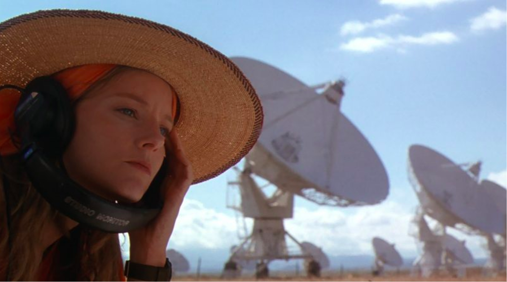

# Evolving digital thinking

>"To transform the world, which is to transform your social problem impacting people in the society, thinking counter intuitively is key to build the cornerstone of your research, salted with many and fast experimentations which will form your DNA in digital solutions to those problems in ways which no other technology organization would consider."

Experimentation, research and formation of your digital DNA

>In the movie "Contact", Ellie is a radio astronomer who, after much dedication, discovers and interprets an extraterrestrial signal. In this journey she constantly learns about knowledge from different areas, including technology, engineering, data, and biology to build a machine to travel in space-time.
