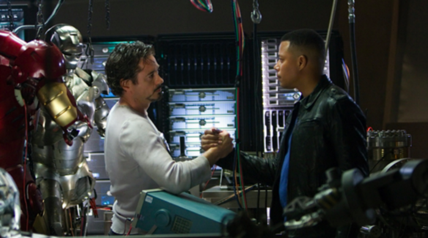

# Fusing business and technology

>"Dive deep into thinking about your business, now think how you could code it, program it, or be open to new business opportunities that are digital native, promoting the disruption of status-quo processes and business models."

| Iron Man |
| :---: |
||
|Continuous research and innovation for value creation|

>In the movie “Iron Man”, Tony Stark is an engineer, businessman and playboy. He develops the most brilliant technologies for military use as a source of his millionaire revenues. Tony's ability to flow naturally through the different worlds of business and technology is his foundation that creates an unfair advantage over any competition. As Iron Man, Tony fuses business and technology as one.

Think for a moment about situations where you've come across people who don't know anything about a wonderful application you use in your digital life. You might think; “How does he live without this service?”. Now think of a large organization, with huge budgets, where, despite the existence of several technologies available, which could facilitate the activities of everyone, such technologies are poorly disseminated internally. And sometimes you don't even know they were available. Think of a large organization that has the best and most expensive technologies available on the market. Applications capable of leveraging process optimization and bringing important insights into the business and the market. Important information for leaders and teams. Information that could completely change the business situation.

Well, it will not be difficult to identify large, world-renowned and successful organizations that experience situations like the one mentioned above. It's like they're drowning in technology. Organizations that have billion-dollar technology-related budgets. Organizations that have the most advanced technologies available in areas such as automation, robotics and artificial intelligence. But what is the point of all these cutting-edge technologies if they are not being applied to their full potential? Because we see people and teams frustrated, trying to run their activities the same way their parents did. Employees are frustrated because they send an email invitation to a meeting and their recipients don't even respond to whether or not they can attend. And at the time of the meeting, they complain that they were not informed about the time and place. Everyone knows cases of employees complaining about systems that do not integrate, generating rework or, worse, forcing teams to enter the same information in several different places.

And now think of yourself as a customer. There are times when, apparently, an organization's support service is totally disconnected with the area that sold you the service. As if they were two different companies. And here comes a common answer. “Sorry sir, there was a failure in our systems. Please, could you contact us later?”. It is at this point that the frustration experienced by employees also reaches customers. Is it a problem with the technologies? How can we conceive of billion dollar organizations, with all the cutting edge available, still facing integration issues, system issues, process issues and IT issues.

The problem is not with IT or with the technologies available. But with the people who form these organizations. It is with the people who are the “face” of these organizations. And just like addicts and smokers who want to quit, the first step is to recognize that the problem exists. Organizations must recognize that they are misusing all the technology they have available. And they must start a movement that allows everyone to know what technologies can do for them, whether they are leaders or employees, whether they are influencers or operational teams. A digital transformation journey determines the beginning of this movement of internal transformation in organizations, allowing available technologies to be understood, tried and applied in the most diverse areas of the organization, with a focus that is fully aligned with the business. Reaching the customer, who will finally be able to experience the products and services of an organization connected with the world, but mainly connected with it.

[<< previous](3-connecting_to_the_exponential_and_infinity.md) | [next >>](5-architecting_for_continual_change.md)
