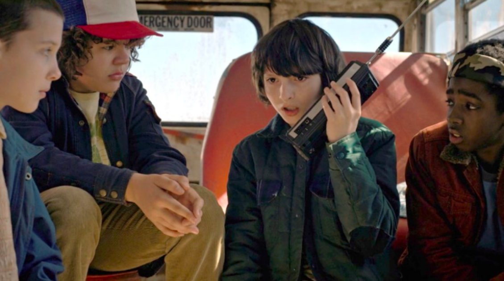

# Trust as a starting point

>"Never before has the need for trust been so great in order to build culture and organizations that are effectively productive, and set in a position for disruptive innovation in many areas and services they build. And maybe, trust is the true value at the bottom of all for an organization, even more today to take a journey towards digital transformation, which demands transformation of you."

| Movie |
| :---: |
||
|Trust eliminates processes and controls at once|

>In the sitcom “Stranger Things”, three friends, the family, and the town sheriff of the missing Will Byers, work together in the search for Will in the upside-down land, where they find “Eleven”, and together forge a closer relationship, with intensity and confidence in carrying out missions to rescue Will.

There is something common among individuals, relationships, families, nations, economies, and even civilizations, and that is trust. Something that if removed, destroys the most powerful government, the most successful business, the most vibrant economy, the most influential leader, the greatest friendship, and also the deepest passion. But if developed and maintained, it has the potential to create unparalleled success and prosperity in every dimension.

Studies with several companies point to the psychologically-safe environment as a fundamental element for the formation of high-performance teams. And psychologically-safe environments are those based on high trust developed among people. Trust among team members greatly facilitates equal treatment, minimization of pre-judgments and greater acceptance of ideas and solutions. In addition to facilitating engagement with common goals. In this way, trust is key to creating psychologically safe environments and, as a consequence, high-performance teams.

Always, the first gesture is to give the vote of confidence. And evolve the degree of trust over time according to the quality of relationships. You don't necessarily have to like someone to trust them. Trust is supported by attitudes, behaviors and results.

The greater the trust between people, the less the need for processes and controls. High-trust environments value consensus, cooperation, and collaboration. And they require fewer rules, norms and conventions. And it is important to highlight that institutions, brands and services are not trusted, but people. Trust is an innate human emotional factor and, once shaken, can give rise to major problems in performance, engagement, efficiency and effectiveness.
trust is

>Being able to express yourself without worrying about prejudices or pre-judgments

>Constantly developed through frequent contacts. It's an exchange

>Formed by rational direct experiences and emotional dedication

>A two-way street, mistakes and failures happen, but not premeditatedly
>There is always a risk involved and there is always the possibility of being violated.
>Guys. Trust in institutions and processes always comes through people
>Based on character, competence and delivery of results

the value of trust

    In a trusting relationship, even if you do something wrong, the other side will still understand.
    In a relationship without trust, even when being careful and precise, people feel lonely and insecure, taking their energy and deteriorating their inner strength.
    Trust-based environments tend to have higher productivity, performance, and lower cost.
    Trust empowers and gives greater opportunities to create solutions, allowing innovation and personal motivation.

[<< previous](0-glassbox_organizations.md) | [next >>](2-culture_eating_strategy.md)
