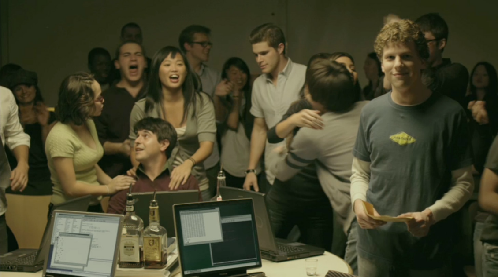

# As within as without

>""

| The Social Network |
| :---: |
||
|Experience, practice, day-to-day digital experience|

>In the movie “The Social Network”, Mark Zuckerberg hires his programmers replicating the same environment lived by university students, in a rhythm of party, celebration and challenges.

Think how frustrating it is for a young graduate, with all his digital experience as a student, consumer and citizen, when he joins a large organization?

When he is at home, shopping, with friends having fun, or even interacting with the financial services offered by his bank, he has all the facilities of the digital world at his disposal. However, upon entering the office, which has fixed working hours, strange and archaic corporate tools, protocol relationships with colleagues, superiors and subordinates, he feels as if he is stepping into a history book.

A major challenge that organizations face today is something that did not exist a decade ago. Until the end of the 20th century, even with clear advances promoted by the information age, the technologies applied were exclusive to large organizations. These organizations offered their employees a high-tech environment, with collaboration and automation tools not seen anywhere else. A newly graduated professional wanted to work in these large organizations to have access to all this technology, gain experience, advance in his career and be satisfied to work in a creative and innovative environment.

With the cheapening of technological infrastructures, the Internet and the advent of outsourced processing services (cloud), access to cutting-edge technology was popularized and several small organizations started the development of technological solutions that are used directly by their customers, through the Internet. , in their homes or offices, in the car and on the street. With this, the world was introduced to high technology through the use of their notebooks and smartphones. The digital experience was popularized and widespread.

Many large organizations have not changed the way they work and have continued with their proprietary environments and technology solutions that were stuck at the end of the 20th century. With little evolution in the way they work internally, these large organizations are now facing stiff competition from tiny organizations, which are new and totally in line with the technological environment that we find in our homes. In these organizations, employees work using the same high technology they are already used to. These organizations offer advantages in their work environments that are making even seasoned professionals change their career paths.
Important issues for a digital environment

    What are the best tools for internal communication in an organization?
    How to establish connectivity capable of allowing employees to contribute whenever they want wherever they are?
    Do offices have all the features needed to promote a creative and innovative environment that boosts productivity?
    How would this new digital generation of professionals like to have their work evaluated?
    What organizational structure model could align powerful market strategies with employee satisfaction, enabling maximum productivity?
    How can leaders be turned into influencers and their followers into followers?

[<< previous](3-whats_in_for_me.md) | [next >>](5-enabling_collaboration.md)
