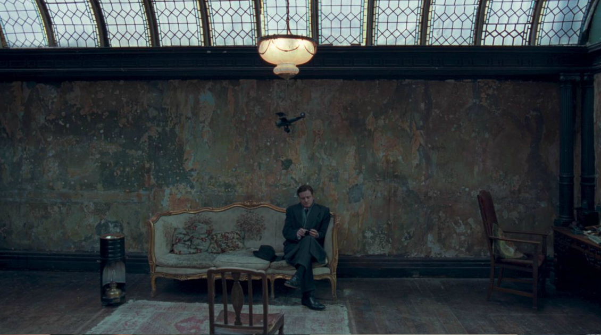

# The Land where customer is king

>""

| Movie |
| :---: |
||
|The customer is right and it generates innovation|

>In the movie "The King's Speech", Prince Albert, Duke of York, stutterer and without ambition, is faced with the situation of becoming King of England. He meets Lionel Logue, a therapist, who treats Albert and befriends one of the closest kings of his people in British history, leading the people through World War II until his death in 1952 as King George VI.

A corporate cliché that means that the direction of a company is ultimately determined by its customers. The business is obligated to sell products and services that customers want and need, at a price they are willing to pay, and provide an acceptable level of service, otherwise customers will look elsewhere and the company will not make money. The problem with this cliché is the fact that the company places the responsibility of making the business viable on the sales teams and shopkeepers, and many of these people do not understand the reasons and decisions taken in the manufacture of the solution, which employ solutions that come from within to outside the organization. Terra que Cliente é o Rei, is the trend that seeks to connect with its customer and end user to create models of empathy to identify real problems and difficulties with services, as well as to obtain ideas for solutions that cannot be observed only in the transaction. of sales. In addition to seeking a resonance with desires and needs beyond the obvious, the customer is a source of innovation. And for this, a close relationship and communication is necessary for the co-creative process of solutions with these customers, and not forgetting the sales teams and shopkeepers that are part of this understanding. Understanding factors and data that are unknown to organizations is where great opportunities take shape and are quickly tested and validated generating greater results and customer retention.
Customer perception is your reality

Customers can be wrong, but regardless, customers are critical to the success of your business and you are responsible for the perception of your business and services, understand what the customer feels, not what they say.
It's easier to keep customers happy than it is to attract new ones.

Too much investment is wasted on attracting new customers, when the most important focus is on keeping existing customers happy and satisfied. By keeping your original customers, you reduce churn and reduce the need to acquire more customers. By giving them a great experience they will positively convey the messages through various media for you. Not providing the good experiences and showing how they are valued can have the opposite effect where customers can share a bad situation with 10 friends and go viral, highlighting your poor service to millions of people.
Without customers we don't have a business

There is no company that doesn't have a customer, they could be internal customers who work for your business or the more traditional customer who buys from you. Regardless, they matter, you need them, and the success of your company or your role in the business pretty much depends on them! A great practice is to ask yourself — “who is my customer here?” And then plan your relationship actions.
Brands win by favoring the customer

Once you've identified your customer, put yourself in their shoes and ensure that everything you're doing is objectively "customer-focused." A good place to start this process is with Customer Segmentation. You must understand the different types of customers you deal with and adapt your approach to their problems. Once you understand your customer's feelings, you can really start to favor them. So if you find yourself thinking, "This is not what we do," then chances are you're not always putting the customer first.

[<< previous](6-breaking_productivity_paradigms.md) | [next >>](8-collaborative_and_productive_ergonomics.md)
