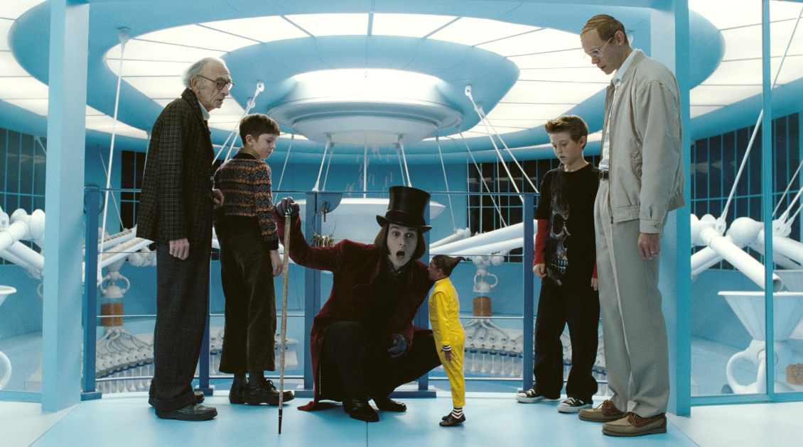

# Collaborative and productive ergonomics

>"Charlie and the Chocolate Factory"

| Movie |
| :---: |
||
|Well-being produces goods|

>In the movie “Charlie and the Chocolate Factory”, Willy Wonka and the Oompa-Loompas operate the chocolate factory that has several different spaces to process the chocolates, the welfare of everyone, including the squirrels, is the productive, happy and creative force.

Digital Transformation demands changes in people, culture, organization and leadership, an element that permeates every company is its ergonomics. And the best way to understand the impact of ergonomics is how much it is disturbing people in the course of their day-to-day activities, since if no impact is perceived, it means that it is invisible and absorbed by people and the culture, which is a great result of the positive experience of employees and company leaders. Ergonomics is not just the office chair and table, it is the set of spaces, furniture, utensils and technology that allow modeling for a transparent, transdisciplinary, collaborative and creative organization. Inadequate ergonomics in this digital transformation journey will have harmful impacts on the development of people's culture and engagement. Ergonomics also has an impact on the health, productivity, quality and costs of the company. Leading digital services companies and startups are innovatively and creatively integrating ergonomics across all operations. And it's no wonder when you examine the benefits of an effective ergonomics process, they are expressive results even in the retention and interest of the job market for these companies, ergonomics is a differentiator for organizational culture.

Just by reducing ergonomic risk factors, you already avoid costs related to low productivity, such as lack of adequate spaces for standing or sitting work, meetings, discussion and design sessions, inadequate equipment such as wifi, projectors, televisions and cameras. Video and phones, which consume people's productive time, also affect their health. In certain cases, it may even lead to the absence of professionals due to these issues. If an employee experiences fatigue and discomfort during the workday, it can reduce turnover, increase absenteeism, worsen morale and reduce employee engagement.

People want to produce incessantly, but they demand different ergonomics depending on the activities they need to perform during their day. For example, using an “open desk” model seems appropriate when employees share this space during the week for certain activities in cells, who is performing an activity alone, needs some isolation to reduce distractions, agile teams need an unfurnished space but good equipment and supports for A1 sheets and Sticky Notes. Some people need to stretch a little, and can work standing up, and a team might be running a Design Thinking session in a room with lots of walls. Conversations and meetings need to serve one person who needs to make calls, and doesn't want to disturb others, two people need to talk, or more, or a large meeting room. All this does not demand great cost, it does demand creativity in planning spaces that can adapt easily and quickly, optimizing the allocation of spaces and furniture. The lego concept has already been widely used in small and medium-sized companies, with very good results in optimizing physical limitations and allowing flexibility according to situations and needs.

Modern ergonomics seeks to eliminate physical barriers between leaders and employees, such as individual rooms, reserved and isolated by glass or walls, since leaders must be involved in people's daily lives and use the same ergonomics already installed for all employees. too much. The issue of transparency is also fundamental, as the company's culture seeks these values ​​of trust, empowerment and security. The organization makes its commitment to safety and health as a core values ​​possible through ergonomics. Consideration should also be given to the company's outdoor spaces, gardens, woods, natural lighting, and we must not forget who is in the “home office”, ensuring that they have the right environment, and not being limited solely to this working model, avoiding isolation and social interaction.

Ergonomics improves employee engagement and collaboration as they realize when the company is making its best efforts to ensure their productivity, health, safety and overall well-being.

[<< previous](7-the_land_where_customer_is_king.md) | [next >>](../chapter-3/0-culture_of_empowerment.md)
