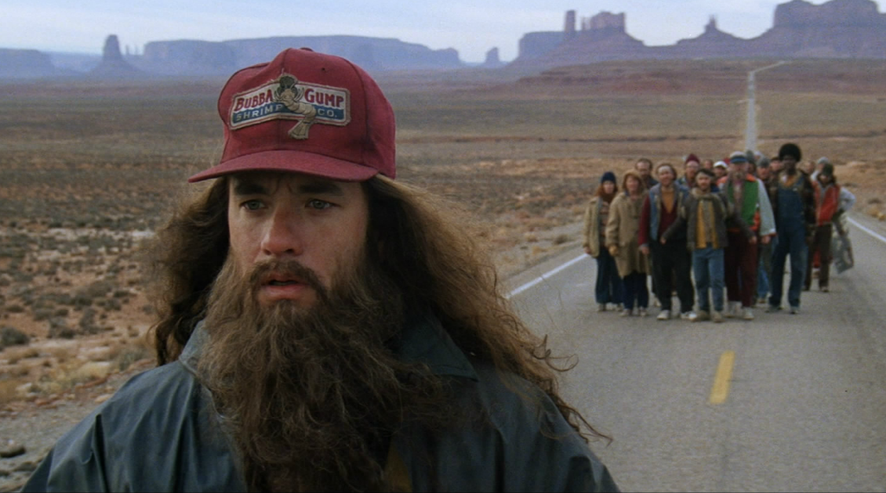

# History of heroes

>""

| Forrest Gump |
| :---: |
||
|Heed the call to adventure, and you'll have great stories to tell|

>In the movie “Forrest Gump” he himself, the Forrest Gump, kept a deep message from his mother. "Life is like a box of chocolates, you never know what you're going to find." Despite having mental and motor difficulties, Forrest allowed himself to come across several boxes of chocolates in his life. Already a successful adult, Forrest had countless stories and experiences to share.

Lately, communication in organizations has become increasingly restricted to objectives and goals, bulleted slides, specifications, use cases and people's profiles in forms. All this being translated into data and numbers. Forgetting a fundamental characteristic, the context. The why, where it comes from, where it is going, when it happened and who was involved. By establishing this coldness in communication, dehumanizing aspects that touch our psyche, with weak connection to attention levels, these communications discourage the reader and do not create the necessary engagement.

Any content we produce is always intended to share experiences, highlight facts or communicate a vision. And they can be communicated in the form of narratives, stories and tales. It's no wonder that books, movies, series and novels hold our attention and sometimes take us completely. The essence of human communication has been genetically transmitted. Our minds change states and open up complete spaces when listening to a good story. After all, long before writing, our traditions, customs, beliefs and sciences were transmitted verbally from generation to generation.

The practice of storytelling has helped organizations to address the lack of engagement, speed of learning, understanding of facts and awareness of strategies and actions. In general, the use of storytelling can be a great facilitator and accelerator in the digital transformation process, allowing participants to see themselves as an important part of construction, production and creation. Increasingly, they are being called to connect to their purpose and the purpose of the organization and to live their adventures within organizations in order to overcome and overcome their limits and obstacles.

The role of organizations is to promote and encourage the use of storytelling, allowing their teams to create and engage in journeys. The organization must have the ability to build stories, led by the people themselves, allowing the creation of a repository of experiences and a knowledge base, which becomes a legacy for the organization. These records can be supported by internal social networks and can include stories of projects, their deliveries, successes and failures. Also, organizations must develop teams capable of continually contributing stories in order to motivate and share knowledge and experiences throughout their careers.

In a Digital Transformation, it is important that the journey can be recorded and that it can create the engagement of all its participants. The Mythic Hero's Journey is a storytelling format that can be used by organizations as a tool with which to learn to create stories and plots in the context of the organization. It creates a strong connection between people, allowing them to feel like part of the story. In general, The Mythic Journey of the Hero follows a plot where one must abandon a condition, find the source of life and, through sacrifices, reach a new consciousness. The addition of a story containing heroes helps us to seek the best version of ourselves, taking into account our strengths and weaknesses and brings a simple way of learning, empathy and engagement.

[<< previous](0-culture_of_empowerment.md) | [next >>](2-the_power_of_the_crowds.md)
