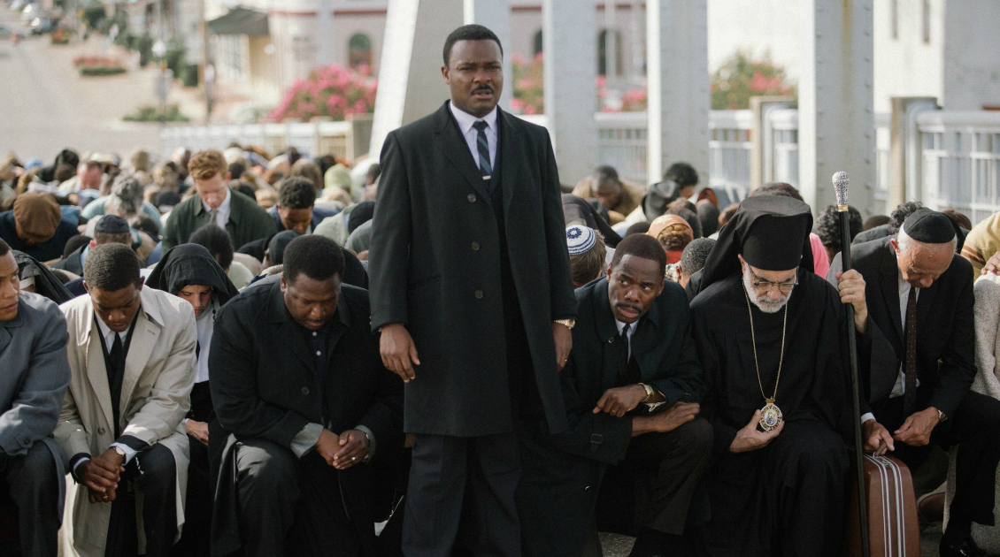

# The power of the crowds

>"The power of crowds is a valuable asset that is often overlooked in organizations. Collective intelligence emerges from altruistic collaboration and contributes to generating new possibilities for teamwork, innovation, and success. Examples of this include free software communities, crowdsourcing and crowdfunding movements, and hackathons. Successful companies such as Google, AirBnB, and Spotify have utilized the power of crowds, demonstrating its effectiveness in digital transformation journeys."

| Selma |
| :---: |
||
|People supporting people, together we do much more|

>In the movie “Selma”, Martin Luther King Jr. is the leader of the black rights movement in the United States. His strategy was to reach the masses, uniting them in marches where people intertwined their arms through the streets of American cities, in a totally peaceful way. This stance restricted violent actions by the police. This movement led the black population to the right to vote and to many other rights that were private and restricted to them.

Much of what is thought and practiced within organizations today, little realizes the value that the power of crowds can bring. Little use is made of the power that human networks are capable of realizing. Whether common tasks or challenges seemingly impossible to solve. The power of crowds brings new possibilities for teamwork to organizations, generating a plurality of ideas as a positive factor. The ability to work with large groups and the strength that comes from it helps organizations succeed in their digital transformation journeys. The model we know of companies today is characterized more by the control in the processes, by the excess of details to be observed in the execution, by the counter-intuitive and inefficient management. Instead of models that promote collaboration, autonomy, empowerment, self-organization of teams and exchange of experiences, capable of awakening collective intelligence.

Collective intelligence can be described as what emerges from the mutual and altruistic collaboration of individuals. It takes into account that no one masters knowledge in its entirety, but everyone knows something to contribute to the purpose. It enables the sharing of memory, perception and imagination, resulting in collective learning through the exchange of knowledge, as well as enabling the solution of challenges that, initially, could be thought impossible to be solved.

A great example of collective intelligence is that created by free software communities. In them, a large number of programmers donates their time and knowledge to contribute to the implementation of innovative technological solutions, which, if they had to be developed internally by organizations, would cost high amounts and, in the way they were developed, can be distributed free of charge, thanks to the altruistic spirit of thousands of programmers around the world. When talking about ideas, we can say that the sum of the parts is much greater than the whole.

The power of crowds can be clearly seen in the crowdsourcing and crowdfunding movements, where people create together and bring products and services to life that didn't even exist yet. We see consumers adding ideas and solutions that organizations alone could not see. They add diversity of thought and accelerate the evolution of innovative products and services.

Another great example of the power of crowds are hackathons, events that bring together programmers, designers and other technology professionals in a marathon, whose objective is to solve a challenge proposed by the organizer and where several teams compete for a prize. In hackathons, everyone works towards the implementation of a solution to a defined problem, but there are no restrictions on how the solutions are conceived and implemented, nor what type of technology will be applied. Usually, hackathons last 48 hours and, during that time, various ideas and solutions are tested, being produced in an extremely accelerated and socialized way, causing opportunities and synergies between people and organizations. And in the end, the organizer can come out with an innovative solution to the proposed challenge. The teams leave with new experiences, partners and one of them, with the coveted prize.

It is important to note that successful organizations such as Google, AirBnB, Spotify, Startse, LinkedIn, Mudamos+, Facebook, Wikileaks, and many other websites and applications use models that exploit the power of crowds. And this demonstrates that having a large community as a producer, reviewer, moderator, investor and provider radically changes the relationship of these organizations with their consumers.

Whether in the search for resources and talent, in the development of new products and services, in the investment necessary to get an idea off the ground, or to seek the development of communities of interest, the power of crowds proves to be an important tool to be explored by organizations. , especially in their digital transformation journeys.

[<< previous](1-history_of_heroes.md) | [next >>](3-managing_for_results.md)

