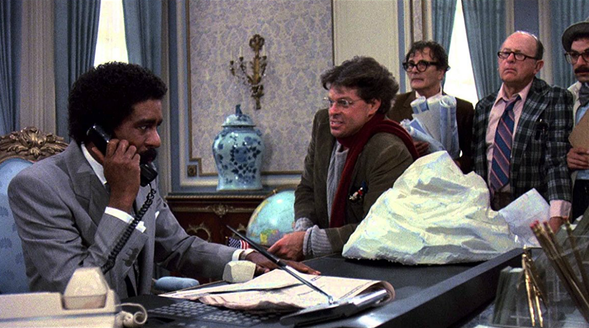

# Things, own or use them?

>"As goods become more accessible and affordable, the traditional concept of power through accumulation of assets has lost its meaning. The sharing economy is taking off in all niches, with services like Uber and Airbnb being born from the union of the population's desire to share through the convenience provided by digital technologies. Organizations can share functions and needs, as core knowledge becomes crucial. The power now lies with the people, as sharing and collaboration gain relevance in the current moment."

| Brewster's Millions |
| :---: |
||
|When using on demand is more economical and generates wealth|

>In the movie “Brewster's Millions”, Monty Brewster is a baseball pitcher who discovers he is the heir of a multi-millionaire uncle. But in order to earn the $300 million inheritance, he needs to spend $30 million in a month, but either accumulate value, acquire tangible things, or destroy anything, and he cannot tell anyone that. His best strategy: lease everything and launch himself as Mayor of New York.

We come from a millenary history where the accumulation of goods was a conventional practice in the search for power. After all, whoever had more assets could do more. However, as the production of goods became less expensive, the barrier to owning a large amount of things was reduced. And today the reality shows that people can own many things, even without having many resources for it. Cars, appliances and even digital inclusion are much cheaper than in the past. And they tend to become increasingly accessible to the population. So where's the power? What does wealth mean? Does it continue to be measured by the accumulation of goods?

And if we think about organizations, how can they differentiate themselves in the market and win customers? If assets are increasingly accessible, how can they earn more? And if the new generations are not interested in acquiring assets, what can they sell to these people?

Currently, there is a “minimalist” movement that thrives exponentially around the world, allied to digital capabilities and the sharing economy. Earlier generations had shelves and shelves dedicated to books, magazines, and music. And they felt they had power for it. Today we can have all this and more in a single smartphone. Think for a moment what this means: for some time it was said that power would no longer be in assets but in knowledge and information. It was the beginning of the information age. We may have even passed that stage, however, today, your smartphone gives you access to approximately 98% of human knowledge, instantly. Do you feel you have power because of it? In anticipation of your answer, no. And the reason is simple. Just like you, the entire digitally included population also has this same ability as you. In short, information and knowledge no longer give power, any more than assets do.

We are at a time that presents an interesting trend, more accessible goods, which despite the lower cost, no longer arouse the interest of new generations. These generations now no longer see power in things, nor in information. They share everything, whether by voluntarily contributing to free software communities, or using asset-sharing services, for example. And services like Uber, Lyft, CarGo and AirBnB emerged because their creators saw that the population values sharing. They were born from the union of these needs with the use of digital technologies. And the latter, mostly created by free software communities, which means they have zero cost.

This trend of sharing solutions using technology as an integrator between demand and supply is a movement that will only accelerate in the coming years. We can own a lot less assets in our organizations and share a lot more. The sharing economy, sometimes also called the collaboration economy, is taking off in all kinds of niches. And most organizations exploring these markets would not be viable if it weren't for the global reach of their services being leveraged by digital. These organizations represent a new way of thinking and innovate in the provision of their services.

We live in the world of sharing goods. The evolution of technologies and their application to new business models has enabled a new world in terms of ownership. Over the generations, from the “Baby Boomers” to the “Millenials”, what can be seen is the continuous decay of having. This form, so encouraged and desired by all generations born before 1990, has been losing its meaning. We are invited to share everything in this new economic modality. Perhaps the new awareness of sharing has been most responsible for the growth and demise of large organizations worldwide. Some being born through the exploration of the needs of new generations and others disappearing due to their locks on the demands of past generations.

This wave of sharing has reached the management agenda of all organizations that want to cross the frontier of digital business. The paradigm previously supported by the property necessary for the full operation of the business, such as the need to have machines and equipment, to have the solution, begins to be questioned. Organizations are starting to realize that knowing their core is crucial and they can share all the other functions and needs of their business. Coworking, Pay as you Go and other business relationship models are on the agenda today. Sharing and partnerships gain a lot of relevance in the current moment. Today it is possible to think of various types of sharing, from physical workspaces to cloud storage.

But back to the question at the beginning. Where's the power now? If we look at the needs, dreams and behaviors of the new generations, we can say that the power is in the people.

[<< previous](4-learning_all_the_time.md) | [next >>](6-whats_up_to_you.md)
