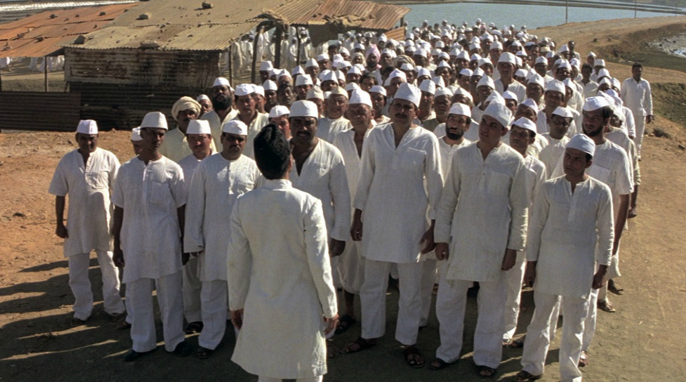

# Leading from the bottom up

>""

| Gandhi |
| :---: |
||
|Winning people's minds is easy, but their hearts...|

>In the film “Gandhi”, Mohandas Karamchand Gandhi, a young lawyer with a high standard of living and education, is thrown off a train in South Africa for not being white. At that moment he awakens his social, humanistic and inclusive conscience. Leading millions of Indians against the British colonization of India, without weapons, without legal actions, but by words, examples and even non-action and reaction, practicing fasting, he gathers the peoples and leads his country to independence.

It is common to see in organizations a vertical management model focused on leadership as a single point in the conduction and search for results. This model has become the target of criticism and the search for changes. Management 3.0 sheds new light on the topic, practically inverting the line of command and control to a model of facilitation, coordination and support for teams.

It is possible to notice that almost all industries are ready for change and prepared for a new vision of the people management and leadership model. Management 3.0 has pointed out studies and approaches that are gaining ground and positioning itself as the future model of leadership and management in organizations.

Management 3.0 is a movement of innovation, leadership and management and is redefining the role of leadership as a responsibility of the group of people. It is about working together to find the most efficient ways for an organization to achieve its goals while keeping employee satisfaction as a priority.

In the Lean view, the “Hierarchical pyramid” is inverted, that is, the highest levels (leadership) occupy the “lower” part and this is no coincidence, it is a way of guiding daily conduct on the “floor of factory”, so that leadership actions facilitate collaboration between teams to accelerate the delivery of quality results. Thinking about customer value, who transforms resources into value is the base, so inverting the pyramid means that the importance, the help, the focus, must be on the people who perform the activities that produce value for the organization.

What we have seen is that the lack of minimum resources (tools, information, inputs, etc.) is the source of conflicts and waste. That is, leadership often invests a great deal of time to think strategically or deal with bureaucratic issues, failing to do the basics and systematically dealing with the same problems.

We believe that this behavior is not conscious, it's not a matter of not doing the basics, but an organizational culture oriented towards meeting higher levels. The leader should be connected with the daily results, he should prioritize the channeling of his energy developing the team, and be always attentive to its needs so that deliveries are made with quality and safety, understanding that human capital is made of people, with personalities, life situations and complexities.

Creating an environment conducive to exposing and solving problems is essential. By understanding the difficulties that your team members have, and making it a habit, the culture of continuous improvement will be built and consolidated. We believe that management is not just a manager's responsibility. It's everyone's job. Leadership pursues the goal of growing and transforming organizations that are great places to work, where people are engaged, work is improved, and customers are simply delighted.

Management 3.0 is a revolution in the management paradigm globally, bringing together thousands of project managers, middle managers, CEOs and entrepreneurs, developing solutions together, using games to encourage employee feedback and team collaboration. You don't want soft management theories and science, you want practical approaches that can become tested solutions to increase employee engagement and improve results.

In a journey of digital transformation in which it is hoped to build a promising future for the organization, and which demands agility, focus, engagement and why not, even animation, introducing up-to-date leadership and management practices is essential to create bonds of trust and extract the real value of willing talents.

[<< previous](6-whats_up_to_you.md) | [next >>](8-your_worst_enemy_you.md)
