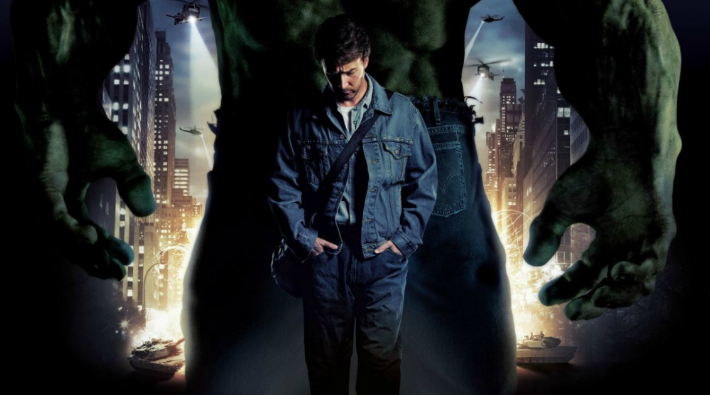

# Your worst enemy, you

>"The Fourth Industrial Revolution demands change, but the biggest challenge is within us. To succeed in digital transformation, organizations must challenge conventional paradigms, have principles and values as a guide, and focus on constructive criticism. Self-knowledge is crucial for enlightened organizations, and the biggest obstacle to overcome is human limitations. To achieve success, employees must embrace new communication and collaboration methods and have confidence in their abilities."

| Hulk |
| :---: |
||
|The incessant search for coherence between the rational and emotional|

>In the movie “Hulk”, David Berner is a geneticist scientist with a great rational intelligence. He struggles alone to maintain his emotional balance to avoid the drastic consequences caused by the Hulk, who takes him in rage and has supernatural destructive powers.

We have to accept that in modern professional life, the only certainty is change and that the future that lies ahead can only be built by us, after all, the vacuum of clarity on the horizon stretches almost to the tip of our noses. We have to challenge ourselves and the biggest challenge is in ourselves. We have to think differently. Challenge conventional paradigms and recipes.

In a journey of digital transformation, the minds of each one involved will be constantly challenged. After all, evaluating, designing, testing, collaborating, discussing, deciding and executing tasks for the deliverables of each milestone not only require smartness and intelligence, but also thinking outside the box, having new insights. But never losing focus on the search for the result that will form the new digital expression for the organization.

Persistence and hard work are not enough. The crucial moments are related to the proposed principles and values, which must already be defined, functioning as the glue for all efforts, confrontations of positions on solutions, designs and implementations. The organization must be able to make independent decisions, using principles and values as a guide. There are times when teams get lost in certain tasks, creating an emotional imbalance, morale shakedown, leading to delays, unproductivity and additional costs. We know that in a digital transformation process, experimentation is common, so failures are also common. All these negative aspects are little considered and openly discussed in organizations, and in fact, they should be the most relevant. Another important point is to understand that decision taken should lead to a certain action. You cannot go back. Only minor route adjustments are possible. And we have to fight the insecurities that can create a climate of doubt in the organization. It is better to be decisive and focused on the goal than to distance yourself and evaluate the path taken, which could lead to procrastination and paralysis.

It's like a climber's life, it's him and the mountain. A vigilance over the antagonistic aspects that the mind will create. And one should focus on achieving the goal. Decisions must be made and translated into action quickly. Rethinking or re-evaluating the decision to have started the climb is not possible. The problem is not how you complain and complain, but how your criticism is. In moments of lack of clarity, we must preserve a posture of constructive criticism. When your mind tells you that you don't know what you're doing or that you're not going to make it, take a while, go for a walk, and then come back and try again. This will make your mind understand the advances, not limit yourself and always empower yourself.

If we consider all the definitions that characterize this new moment in the development of humanity, also called the Fourth Revolution or Industry 4.0, there is a tendency to point to the human being as the most important factor. We understand the fundamental need for self-knowledge to have enlightened organizations, consequently productive and creative. The time is now for the employee to look at himself and no longer at others. The big challenge now is to be able to make a paradigm shift at the pace that the organization needs. It's time to stop complaining and take consistent action for change. Digital transformation starts with people and not technologies, so the biggest obstacle to overcome is human limitations.

There is always a strong tendency to think in a traditional and conventional way, and to feel insecure when faced with a challenge. This is the time for the employee to bring a new form of communication and connection with the team and to be open and willing to face challenges head on. Collaborating always helps in strengthening and self-confidence, after all, we as human beings are social beings.

[<< previous](7-leading_from_the_bottom_up.md) | [next >>](../chapter-4/0-commiting_to_values.md)
