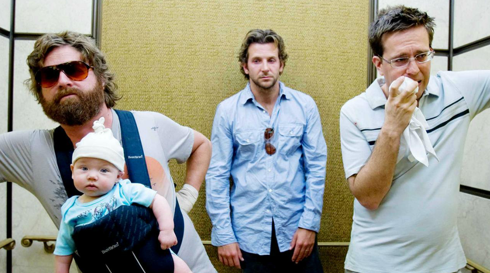

# Transparency is everything

>"In the movie "The Hangover", friends reveal the truth about their wild night in Vegas, showing that honesty is important. Similarly, in the age of transparency, organizations must prioritize transparency and ethics to gain trust from customers, employees, partners, and society. Transparency in products and services, hiring, decisions, and communication are key aspects that impact an organization's reputation. "Glassbox" is a new trend that emphasizes the importance of a company's culture and values being transparent to consumers."

| The Hangover |
| :---: |
||
|To err is human, denying it is a lack of character|

>In the movie "The Hangover", friends Alan, Phil and Stu travel to Las Vegas for their friend Doug's bachelor party, they live the worst drunk of their lives, but pressured by their wives, they open the game about What happened.

We live in a time when organizations and their structures are increasingly visible to their shareholders, customers, employees, partners and society in general.

Currently, the “reputation” is questioning the “marketing image” of organizations, that is, those created to form positive and previously planned impressions before the public, usually through traditional advertising. With the disintermediation of the media, the audience itself has become a producer of informational content and socializes impressions and experiences with brands and companies with their peers. The “age of transparency” is revolutionizing all aspects of the market and society, forcing organizations to rethink their core values.

In this new scenario, we have the drop in trust in institutions, including even the most traditional ones, the drop in advertising, which has been predicted for some time, the “fake news”, and a series of other circumstances that promote an appreciation, almost imposed from an ethical and moral posture, whose pillar is based on the transparency of organizations.

The crisis of confidence in governments and organizations, driven by financial and political scandals, is leading people to increasingly value the transparency and ethics of companies. These two attributes appeared for the first time in a survey by the Ipsos Institute. On the occasion, the people interviewed revealed that the attributes they most admire in a company are precisely these. In a similar survey, carried out two years ago, the items 'ethics' and 'transparency' were not even among the ten most valued. Although this topic involves the most diverse scopes of organizations, it is worth exemplifying some circumstances in which transparency has a relevant impact.

Transparency in products and services: although “the fine print” is still used in some circumstances, for technical reasons, the notion of “hiding” important information from customers no longer thrives. People, nowadays, no longer admit to feeling cheated and betrayed by dubious messages, in an attempt to exclusively favor sellers. On the contrary, what is perceived today are products and services that are increasingly clear about their deliveries, including, in several cases, charging only and exclusively for what the customer actually uses, making them more attractive and fair.

Transparency in hiring: if we consider the new generation that embarks on different jobs in organizations, it can be seen how important transparency is. Most of them are not just looking for a job, but something that gives them a greater sense of accomplishment. When they realize that the company was not transparent at the time of hiring, and that the activities they are developing are no longer in accordance with the proposal, they do not hesitate to leave their jobs in search of an experience that is more open and motivating to them.

Transparency in decisions: it is not always possible to consult with all people to make decisions. Most of the time, leaders take responsibility for them. However, modern and agile organizations lead their teams to organize themselves in the pursuit of the outlined objectives. For this, investing time in alignments is healthy. Transparency leaves no room for misinterpretations that often generate unnecessary gossip, which negatively affects employee satisfaction.

Transparency in communication: one of the most important activities in an organization, communication takes place at all times between the various participants in its interaction network. In this sense, clarity and objectivity are important for these peers to be able to absorb and constantly reinforce the values and principles that govern the organization's performance.

A new trend is known as “Glassbox”: Your internal culture is your brand. In other words, the narrowing of the company's culture with its consumers is evident, not only due to the transparency promoted, but the fact that there is no longer any escape in moving towards transparency. Is your company a Blackbox? So find out what your DNA culture is for your business and value proposition, it needs to be original, there's no copy and paste recipe, and it's closer to your heart than you might think.

[<< previous](2-sense_of_justice.md) | [next >>](4-the_problem_is_yours.md)

