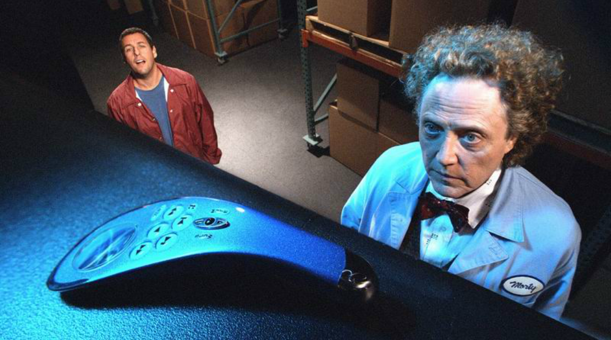

# This is for yesterday, ok?

>""

| Click |
| :---: |
||
|Eliminate activities that take you away from your goal|

>In the movie “Click”, Michael Newman meets Morty an inventor, who gives him a remote control for his life, being able to move forward and backward in time.

Time is money, and if that time takes your effort, it gets even more expensive. In today's times, the perception of time is extremely accelerated, people's attention span is reduced, and the speed is practically mind-blowing. In this way, designing processes and functions that require learning, many steps, constant user actions, continuous interruptions with little integrated intelligence, extensive content, very formal communication, will not only denigrate the user experience, but will make them feel extremely frustrated, and will likely abandon the product almost immediately, and with no turning back, since there are so many options for so many services, what will be left is a negative memory about your brand and company.

Even when we follow a lean concept for a service in the market, its value proposition is completely mediated by the experience that will be lived by the user, there is no excellent idea of a value proposition or business model that is supported by a bad experience. So knowing the User Experience practice is mandatory, but knowing very well the ecosystem of solutions related to your service, and other services and solutions in the market and conventional standards is essential, in addition to bringing a ubiquitous proposal to the customer, that is, being where is he.

Your customer aspires for total automation to be highly productive, efficient and that this generates returns, and on the other hand, the company must aspire to minimize as many processes as possible, either through the review of procedures, changes in paradigms and rules, redesign of the journey combining with data services such as social networks, integration with APIs (Application Interface Protocols) that complement with other data and processing of other information, bringing in an intuitive and intelligent way an experience that seeks the nullity of action by part of the user, and make him feel like a super hero, and not a person full of activities, uncertainties and doubts.

Millions of consumers are already comfortable with automation and the use of artificial intelligence to have a conversation of meaning and relevance, much more human and conversation-based, instead of exchanging data in a form, a queue for service. over the phone or chat to be answered by someone real. The use of machine learning in processes combined with other data and service APIs, helps a lot in automating processes and activities both inside and outside the company, freeing up your time and energy to focus on the heart of your business and value proposition. , as well as human factors to create the differential of value in the market and enhance the competitive advantage of your business.

The big question is to seek the anticipation of events, conditions and situations to reach that nullity of action on the part of the customer, creating the enchantment and feeling of magic in the customer's relationship with your service. It is much more focused on customer data and events that enter a context to be processed by your business model in connecting demands to offers produced by your service than waiting for a user's own action. Understanding modern consumer trends is fundamental, today's reality is the post-demographic reality, the number of niches has quadrupled, and understanding your customer's life situations is the key to understanding the activities they need to perform, as well as if anticipate and seek to assist the journey he desires, educating him, directing knowledge and experiences relative to where he wants to go.

[<< previous](4-tasting_your_own_cupcake.md) | [next >>](6-designing_conversations_as_user_experiences.md)
