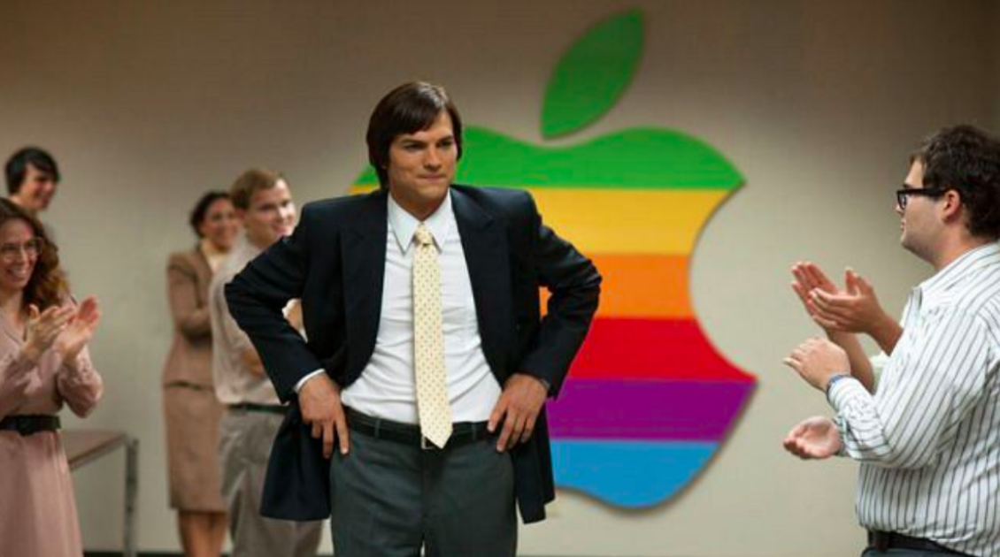

# White is the new basic

>""

| Jobs |
| :---: |
||
|Simplicity facilitates the adoption of your product, simple as that|

>In the movie “Jobs”, Steve Jobs builds Apple by focusing on the user experience in a tireless way, having experience in typography, he applies simplicity to all products, making the personal computer, and in the future the smartphone, in tools of easy use and adoption. of technology.

Since the industrial revolution we have been dealing with a diversity of products and services, which practically exposed how engineers, administrators and designers think about what they create, tasks were practically imposed on their users and books of user manuals. With information technology still evolving, the final design of the product and services has been allied to the final product, linked to aesthetics, but never sacrificing ease of use.

Simplicity is a design philosophy and is practiced by many successful companies and having consumers as fans of those companies. But designing simple solutions can be harder than you think. You need to work persistently to keep your mind clear to simplify, and keep the organization focused on simplification. But it's really worth it, because once you get there, you'll enjoy great results.

We came from a time of high complexity on the Internet, excessive use of images, content, links and calls to action, a fight of pixels which bring nothing but confusion and a high rate of abandonment. It's no wonder that the trend of communication by messages, Bots and visual and voice interfaces of applications were extremely clean, with few functions, and bringing data and other utilities automating and complementing the journey and experience.

Good design is obvious, and easily recognized by your consumers, good design is transparent. Designing product and service interfaces that consider user goals, offering the simplest means to achieve those goals, is the pinnacle of design sophistication. Simplicity in design isn't just about the colors you use or the white space you include, it's about immersing the user's mind in your goal. Using this understanding of simplicity is critical to designing a product that destroys inconsequential elements and narrows the gap between the user's goals and the means to achieve those goals through your product.

Some very relevant points of attention for the design of your products and services.

Maintain Clarity: Understand and design your users' key goals. Clarity lets your users understand what you're trying to achieve. If your design has a lot of information, users will have trouble understanding its usage. Help the user understand the message you are trying to convey and the actions the user can take within the first few seconds of browsing.

Use automation: design for a minimal amount of conscious and cognitive effort, well-rehearsed behavior becomes automatic. This refers to the tendency that humans perform common, practiced tasks with a minimal amount of conscious and cognitive effort.

Fewer options: design thinking about information and communication with interaction, people detect only those things relevant to their objective, in their own context. The best user interfaces guide users through the desired path with a clear indication of the steps needed to complete their goals.

Get to the point: make your users see how your product can help them achieve their goals. Close the gap between a user's goal and the means to achieve it. The harder it is for the user to see a way to accomplish their goal, the more likely your users are to give up on your product.

[<< previous](7-sense_of_belonging.md) | [next >>](../chapter-6/0-technology_as_levers.md)
