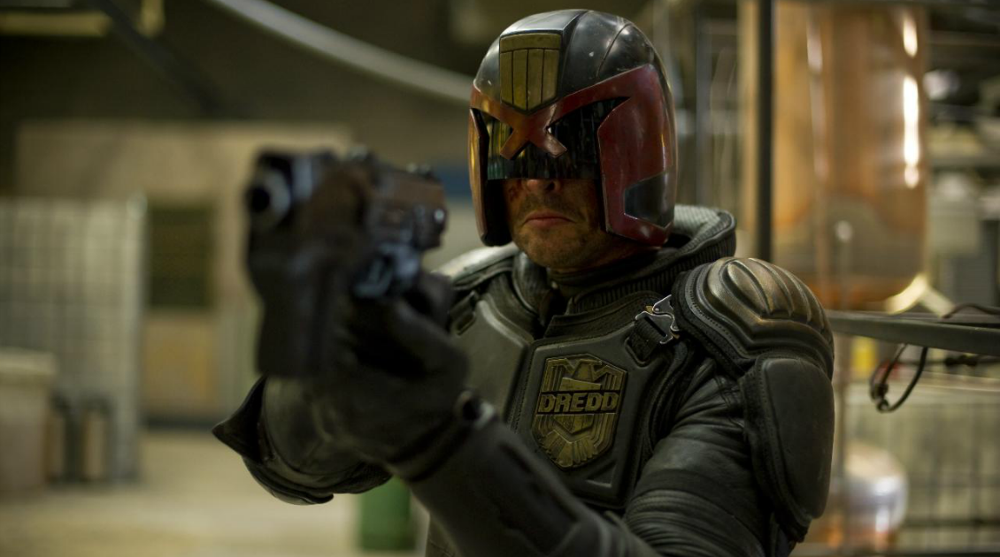

# The blockchain fungibility

>""

| Judge Dredd |
| :---: |
||
|Building transparent and disintermediating chains|

>In the movie “Judge Dredd”, Joseph Dredd is a dedicated “Street Judge”, with authorities to be jury, sentencer and executioner. All judges are connected to the law operating in a decentralized way, but their DNA betrays them to a crime of murder, implanted by a traitor judge, breaking the chain of trust.

Technically speaking, blockchain (“Chain of Blocks” in English) is a systems architecture that forms a technology, it is a type of distributed database, which has the function of public ledger (account balances and transactions) , where transactions are recorded and updated on all distributed data copies. Bitcoin is a decentralized cryptocurrency-like digital currency supported by blockchain technology. It is also an alternative economic system. It was featured in 2008 on The Cryptography Mailing mailing list by a programmer (or a group of programmers) under the pseudonym Satoshi Nakamoto. To this day, it is not known if it is really a person, a group or any other entity. We can treat Mr. Nakamoto as a virtual entity. Scary, no?

But what impact does blockchain technology bring? Is this related only to the cryptocurrency financial market? According to several experts, blockchains, the technology that supports cryptocurrencies, could revolutionize the world economy. It has the power to facilitate collaboration and tracking of any type of transaction or interaction. And, perhaps, it is the technology that can provide genuine privacy protection and the guarantee of the truth, since everyone has a record of everything that happens, which introduces an inviolable transparency.

In the early 1990s, we used to say that the old media were centralized. It was one-way, one-to-many, controlled by powerful forces, and we were all passive consumers. Now, on the new web, we have the new media. It is one-to-one, many-to-many, highly decentralized, everyone is a participant and not just passive consumers. It promotes an interesting neutrality. She is what we would like her to be. It can promote equality and create a more prosperous society where everyone benefits from the wealth everyone creates. A lot of cool things have happened, but overall, the benefits of the digital age have been asymmetrical. For example, today we have powerful organizations and governments that hold large assets in important digital data. Organizations seek to “monetize” such data, even if produced by others. And governments use them to spy on citizens and privacy is invaded.

What if we had a second generation of the Internet available that enabled real, reliable peer-to-peer value exchange? We don't have that today. If, today, I have to send some money to someone, I have to do it through an intermediary, it could be a powerful bank or a credit card company. And, I still need a government to authenticate that I am myself and that the other person is really that person. What if we could transact peer-to-peer? What if there was a reliable protocol that would allow us to create trading or currency exchange transactions, without the powerful middleman? Well, blockchain enables all of that.

The world is currently on the verge of a major rupture, which will certainly start with the financial market. All services, without exception, provided by this market can be implemented in a decentralized way using blockchain. With this big “flea behind the ear”, the financial industry is moving, assimilating new technologies, including blockchain, and innovating in its services. Market disruptions empower innovators and overturn powerful liabilities.

However, potential market disruptions can occur in any market. All markets work with the exchange of values. And that exchange can be completely transformed. An example is the music industry. From the point of view of the author and the musician, it is a total disaster. Most of the value produced by authors and musicians goes to the big distributors and technology organizations. And only a small portion returns to them. Music, like digital assets, can be transacted using blockchain as a support. If so, it becomes a decentralized value exchange, ensuring that value for the work performed is distributed to authors and musicians, without intermediaries.

So, get ready for breakouts ahead. During digital transformation journeys it is vital to know technologies such as blockchain. Is it worth being just a passive consumer, like in the old media, or starting to lead transformations in this sense?

[<< previous](7-there_is_an_app_for_that.md) | [next >>](../chapter-7/0-partnerships_to_augment_powers.md)
