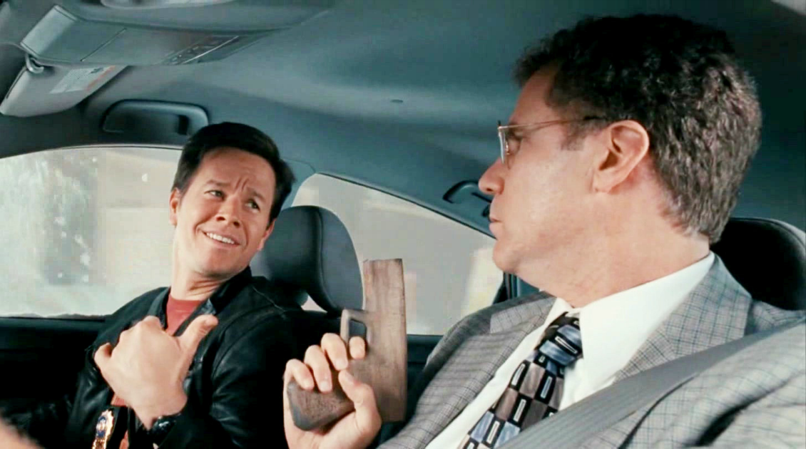

# Dialoging your relationships

>""

| The Other Guys |
| :---: |
||
|There's more to appearances than you might think|

>In the movie "The Other Guys", Terry Hoitz, a demotivated and tough detective, is forced to partner with Allen Gamble, a bureaucrat within the police. After a lot of bullying, attacks and refusing to be his partner, Terry discovers amazing things about Allen, and together they solve a case of a grand theft involving big figures in the city.

We all know that in today's digital world, an organization is unlikely to succeed if it wants to do everything. Whoever tries to completely master and provide himself with a Value Chain, carrying it out from beginning to end and adding all these required capabilities will become excessively complex, expensive and unmanageable. Partners are essential at various stages of the Value Chain. Through good partnerships, the organization will be able to focus on delivering its value and differential to its customers.

The other day, one of my colleagues asked me, “What is the difference between a supplier and a true business partnership? This is a vital question when any person or company is innovating. And the reason is that when someone is doing something really new, it's almost impossible to specify in advance everything you're going to need from your partners. Thus, partnerships for innovation require that the relationship between the parties be very transparent.

The best way to measure and understand your real relationship with your partners may be to observe whether certain conditions exist, such as:

Cultural alignment: do partner companies share the same business and management culture?

Mutual gains: are there effective gains for both parties in this relationship?

Reciprocity: there is a mutual interest in the continuity of the relationship

Learning: is there an exchange of knowledge and learning between the parties?

If this comes through clearly, we can have a context for a good, long-term and successful partnership.

But why is it important to fine-tune the partnership?

The adage that two brains working together are better than one may explain why many entrepreneurs and small business owners form partnerships. However, it's not just these brains that must work well together. Partner personalities also need to get along. The strength of the relationship you have with a business partner is an important determining factor in the success of the business as a whole. And the key to building that strength is ensuring an ongoing, open dialogue. Communication is an important part of a business relationship. Ongoing dialogue is important because it helps reduce the risk of making assumptions and encourages everyone to stay focused on their shared vision. Of course, there is likely to be some miscommunication or disagreement. But this is natural, but attitude and posture in the face of adversity is the fundamental factor. If the relationship is one of mutual trust, failures will be understood, addressed and resolved through continuous improvement. Open communication builds trust, minimizes misunderstandings and increases efficiency.

Real business partners have mutual vulnerability and share risk management. And that means working together to create new possibilities for the future. Given the timing of the current economic environment and the speed at which businesses are transforming, companies that are able to forge true partnerships will have the most opportunity to differentiate themselves in the marketplace and achieve commercial longevity. In addition to making this whole process much more fun.

[<< previous](2-assembling_your_value_chain.md) | [next >>](4-curating_the_ecosystem.md)

