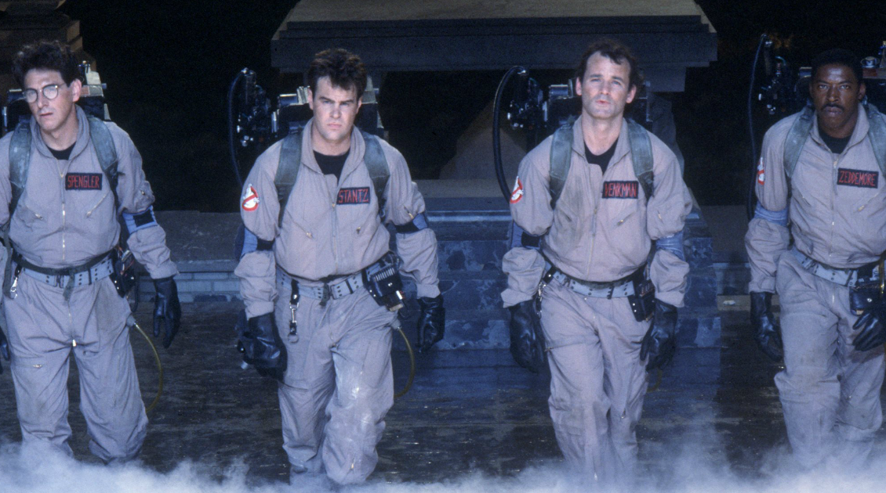

# Ghost and witch hunting

>"he movie "Ghostbusters" is used as an analogy to highlight how businesses can suffer from outdated processes and disconnected systems, causing employees and customers to become zombies. To overcome this, companies should reduce silos, identify and improve processes, reduce verticalization, and prioritize multidisciplinary and transdisciplinary action. By doing so, organizations can identify valuable data, applications, and platforms and use them to increase efficiency and innovation within the ecosystem. This witch and ghost hunting process can also help businesses focus on what is important and mandatory while thinking differently about these aspects."

| TBD |
| :---: |
||
|Eliminating dusty processes and recovering zombies|

>In the movie “Ghostbusters”, Peter, Raymond and Egon are university professors of parapsychology and metallurgy. They were primed and ready with their innovation, a proton backpack that captures ectoplasm, a trap for trapping and transporting ghosts, and a storage receiver. When businesses discovered they were infested with ghosts, and saw that this scared the customers, The Ghostbusters grew their business a lot.

Over time, applications, processes, rules are gathering dust on the company's shelves, they are disconnected. This causes great distress on your employees and impacts your customers, turning them into “Zombies” running and consuming services, just because they are. Understanding the company's architecture in terms of organization, processes, technology, applications, is essential to get out of the hunt for silos, inconsistencies, inefficiencies, and even in many cases, "pac-mans" of money, which do not generate any return.

Many companies make genuine efforts to enhance their ability to create, communicate and deliver value. However, in many cases, this initiative goes towards actions “from the door out”. Nothing against. The big issue is that most of them disregard their internal potential to be used in these constructions and, in some cases, bring more problems from the outside to the inside than agile and contextualized solutions. There are many more assets installed in organizations than you might think. In this direction, it is clear that organizations seek to seek external solutions because
they have little skill in working the way they solve their problems. Usually what they do is look for culprits. Thus, people are afraid of taking risks and making mistakes. This model is perpetuated “from the top down” and, in addition to exorcising creativity, it creates an unpleasant environment in the organization, a haunted place.

On the other hand, existing problems should be seen as a learning opportunity. Instead of looking for the culprits, look for the root causes to actually solve them. With this mindset, people feel more comfortable creating and learning. Although there are a good number of elements that can be addressed, some are critical and deserve attention because, when worked on, they can considerably increase the possibility of substantial improvements just by looking at the “internal doing” of the company.

Reduction of silos: as long as each sector only thinks about its scope, transformation does not occur even if you force the door. Many companies are unable to make their sectors communicate and cooperate towards a common goal, business success. Typically, silos arise where there is no concern for effective communication or maintaining the organizational culture.

Identification and improvement of processes: process management values the synergistic interaction between the different activities that are performed by a company, considering multiple areas. In this sense, it is important to keep in mind that the search for improvement must consider that processes can be optimized, created new ones, but also eliminated, reconfigured, most of the time.

Reduction of verticalization: excessive verticalization at different times hinders and wears out certain processes, including those related to innovation. This model generates dependence on strong leadership at the top. If management is weak, all hierarchical structures can suffer from a bad decision made by the superior. In horizontalization, employees become more motivated because there is not so much bureaucracy in the management of problems, under which they can determine the time and way in which they deal with the challenge.

Multidisciplinary and transdisciplinary action: digital transformation demands a collective and integrated effort from the entire organization. In this sense, it finds less friction in organizations that work privileging the approach of fluid projects, with a systemic vision and oriented to recognize the importance of each value-generating element in the processes, as well as valuing the experiences and knowledge resulting from these interactions, even in the face of the heterogeneity.

Keeping the house clean and accumulating “things”, in addition to drying the machine, allows finding artifacts that were no longer remembered, such as data, the possible correlation of these data, applications that can be consolidated, eliminated, or replaced by platforms and SaaS (Software as a Service). The insights in this witch and ghost hunting process allow the organization to question, from the perspective of value and focus on customers, what is really important and what is mandatory, and how to think differently about these aspects, seeking efficiency and innovation within of your ecosystem.

[<< previous](5-landing_without_visibility_and_instruments.md) | [next >>](7-storytelling_not_specifications.md)
