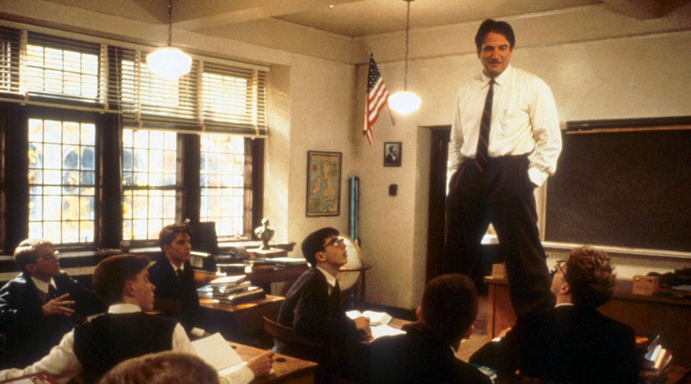

# Storytelling not specifying

>""

| Dead Poets Society |
| :---: |
||
|Using narrative to attract new challenges|

>In the movie “Dead Poets Society”, John Keating is a teacher at a prep school for boys. Keating inspires his students to understand poetry, creating an analogy for their own lives and helping them to pursue their passions and make their lives extraordinary.

We all tell stories. It's one of the most natural ways to share information and we know stories very well. But can we use stories in the environment of organizations?

Storytelling and User Journeys play an extremely important role in the digital transformation process in organizations. Stories help us bring people together and communicate situations, research, results, as well as putting a human face on data that is purely analytical. They help us communicate design ideas, encourage collaboration and innovation, and create a sense of shared purpose among people, integrating everyone in an easy way.

You might be surprised at how many different ways you can use stories in your work. The narration begins with the audition. During conversations with your customers and employees, formally or informally, take the time to hear their stories. You might be surprised at how many fantastic stories you'll collect. Just say “Tell me a little about this” and you will see the beginning of a compelling story rich in detail. The organization's culture is the result of everyone's day-to-day interaction sharing stories. When people tell you stories, they may also tell you something about how they relate to your organization's purpose.

These stories can also be the start of a great story for a persona and provide an environment of empathy. And from this story, create a new journey that will generate ideas, use of technology and innovations. Put a few stories together and you can have the spark of a new design. You might call them user stories or scenarios, but they're ways of thinking about not just what's going to happen, but how characters will react to the experience.

The use of stories in the definition of journeys is considered as a tool that can be used by squad teams, facilitating the Agile process and allowing a greater understanding of what you want to design, implement and test, instead of extensive use cases with functional requirements and non-functional. In addition to empowering multidisciplinary teams to create solutions. Whether dramatically or in fact, tell stories that throw people a situation they want to resolve or an experience they want to explore.

A user journey story is like a chain of events from the user's point of view. The history events show the evolution of this user's experience, along with the solution used. A successfully crafted story must be compelling and evoke emotion, transcending process, culture and experience. It can describe a current situation or a situation to be defined in the future. The structure and components of user experience stories are not far from fairy tales, classical theater or box office movies. But unlike classic stories, user stories need to elaborate more on the user's actions and interaction activities with the solution.

But what would a good story look like to be applied in the process of digital transformation and integrated into development processes? You need to pay attention to elements that generate a broad understanding of your listeners, such as:

User: Compelling stories should have a clear and complete main character that the listener can empathize with.

User Purpose and Motivation: Purpose establishes a clear understanding of the task at hand, while user motivation helps the audience see the meaning behind user behaviors and decision making.

Context: Context is the setting in which the story takes place. Provide an environment for the story and help you understand where the designed experience fits.

Plot: A plot describes a series of events along a timeline. Often, these events create tension and crisis, which challenge the main actors and engage listeners.

Vision: While the previous four components are straightforward, vision is where storytellers must enter their understanding and communicate to the audience the meaning of the situation.

Spectacle: Spectacle refers to everything that supports the story. These can be props, drawn illustrations or videos. The spectacle often makes the story more memorable and enjoyable, and keeps the audience interested and involved.

The use of storytelling facilitates understanding and memory. Stories improve the ability to retrieve information as they activate and connect various parts of the brain. They also pave the way for persuasion and a call to action. When the characters and plot are more persuasive, the audience feels engaged in the story and the chance of the story generating the desired outcome is much greater.

[<< previous](6-ghost_and_witch_hunting.md) | [next >>](8-making_everything_versus_connecting_everything.md)
